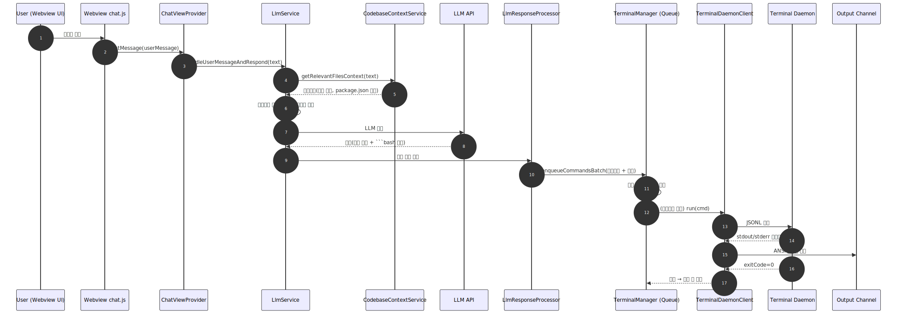
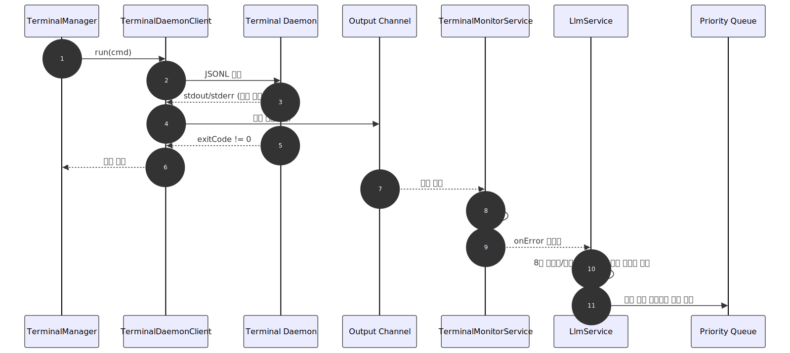
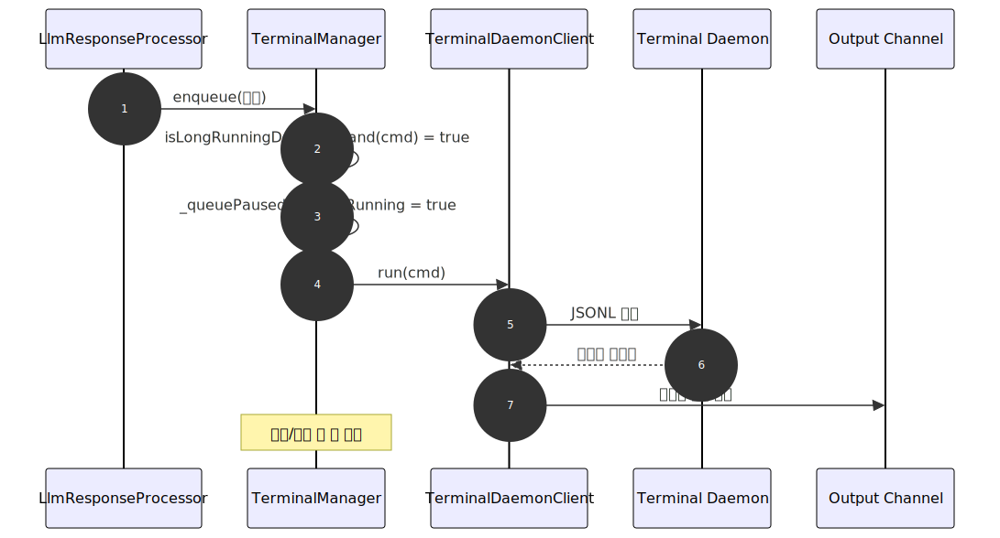
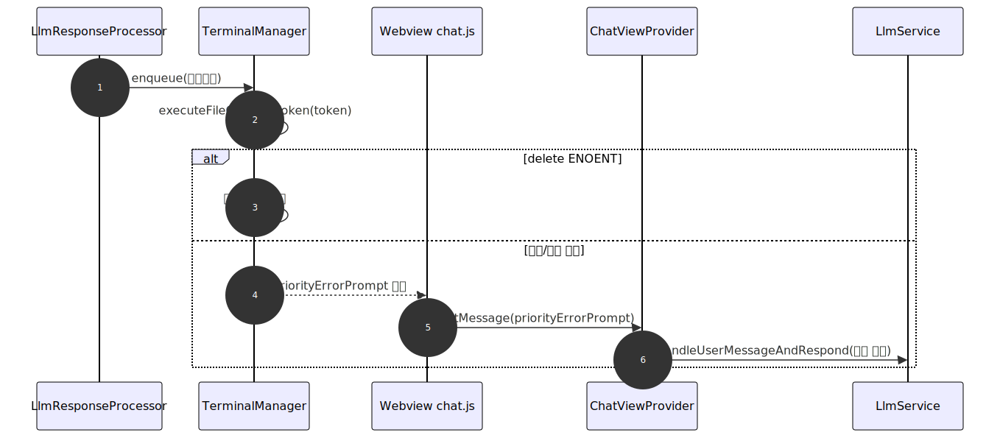

# AIDEV-IDE 자동 실행/에러 처리/전송 및 컨텍스트 수집 구현 상세 (v3.0.0)

본 문서는 v3.0.0 기준 구현을 설명합니다.
- 터미널/데몬 기반 명령 실행 오케스트레이션(큐, 대화형/장기 실행 분기)
- 에러 감지와 LLM 우선 재전송(쿨다운/조용한 취소)
- 사용자 질의 기반 키워드/파일 검색(컨텍스트 수집, package.json 우선 포함)
- 전체 워크플로우(이벤트가 어디서 시작/전달/종료되는지)와 시퀀스 다이어그램


## 1) 구성요소 개요(모듈 역할)
- Webview `chat.js`: 사용자 입력, 대기 큐 UI, 링크 클릭 가로채기(`open?path=`), `priorityErrorPrompt` 우선 처리
- `ChatViewProvider`: Webview ↔ Extension 브리지, `openFileInEditor`, `handleUserMessageAndRespond`
- `LlmService`: 인텐트 분석, 컨텍스트 결합, LLM 호출, 전체 프롬프트/배너 로그, 에러 이벤트 구독 후 우선 재전송
- `CodebaseContextService`: 키워드 추출/정규화, 파일 검색/점수화, `package.json` 최우선 포함
- `LlmResponseProcessor`: 파일 작업 파싱→파일 토큰화, bash 명령 추출(주석/공백 필터), `enqueueCommandsBatch`
- `TerminalManager`: `_priorityQueue/_normalQueue`, 장기 실행 pause, 파일 작업 토큰 실행, 데몬/터미널 라우팅, 출력 정제/로그
- `TerminalDaemonClient`: Unix 소켓 JSONL 통신, stdout/stderr 스트리밍, exitCode 반환
- `TerminalMonitorService`: 에러 패턴 매칭 후 `onError` 이벤트 발생


## 2) 엔드-투-엔드 워크플로우(설명)

### 2.1 정상 플로우(파일 작업 → 명령 실행)
1) 사용자가 Webview에 질의 입력 → 확장으로 전달
2) `LlmService`가 인텐트 분석 및 `CodebaseContextService`로 컨텍스트 수집( Node.js면 `package.json`을 최상단에 고정 )
3) 전체 시스템 프롬프트/유저 파트를 배너와 함께 로그로 남기며 LLM 호출
4) 응답에서 파일 작업을 토큰화하여 큐에 먼저 적재, ```bash``` 블록에서 주석/공백 제외 후 명령을 큐에 이어 적재
5) 큐는 파일 작업을 순차 적용(디렉터리 생성/쓰기/삭제)한 뒤 명령을 실행
6) 비대화형/짧은 명령은 데몬으로, 진짜 대화형은 VSCode 터미널로 라우팅
7) 데몬 출력은 ANSI 제거하여 Output 채널에 기록되고, 정상 종료 시 큐가 다음 항목으로 진행

### 2.2 오류 플로우(명령 실패 → 에러 우선 재전송)
1) 데몬 실행 결과가 `exitCode != 0`이거나 stdout/stderr에 에러 패턴(예: `npm error`, `Missing script:`)이면 실패로 판단
2) Output 채널에 실패 로그/종료 코드를 기록하고 모니터로 공급
3) `TerminalMonitorService`가 에러 패턴을 감지하여 `onError` 이벤트 발생
4) `LlmService`가 이벤트를 구독해 8초 쿨다운으로 중복 방지, 진행 중 LLM 호출이 있으면 조용히 취소(suppress) 후 에러 요약 프롬프트를 우선 전송(priority)
5) 새로운 수정안/대안 파일/명령이 큐에 우선 적재되어 즉시 실행

### 2.3 장기 실행 플로우(`npm run dev` 등)
1) `TerminalManager`가 `isLongRunningDevCommand`로 장기 실행을 판별 → 데몬 경유 실행
2) `_queuePausedForLongRunning = true`로 큐를 일시 정지, 로그 스트림을 Output에 계속 기록
3) 사용자가 중단하거나 실패 시 큐를 재개, 실패라면 2.2 흐름을 통해 수정안이 우선 전송됨

### 2.4 파일 작업 실패 플로우
1) 삭제 시 ENOENT는 안전 스킵하여 큐 진행 유지
2) 그 외 파일 적용 실패 시 `priorityErrorPrompt`를 Webview로 보내고 `ChatViewProvider`가 즉시 LLM 재호출(우선)


## 3) 시퀀스 다이어그램

### 3.1 정상 플로우


### 3.2 오류 플로우(명령 실패)


### 3.3 장기 실행 플로우


### 3.4 파일 작업 실패 플로우



## 4) 구현 포인트 요약
- 댓글/주석/공백 라인은 명령으로 취급하지 않음(`#`, `//`, `/*`, `*`, `*/`).
- 모든 실패는 Output 채널에 기록되고 모니터가 패턴으로 감지하여 LLM에 재전송.
- Node.js 프로젝트에서는 `package.json`을 항상 컨텍스트 최상단에 포함.
- 장기 실행 명령은 큐를 일시 정지하고 종료/중단 시 재개.
- 파일 삭제 ENOENT는 안전 스킵으로 큐 진행 유지.


## 5) “실행 큐 적재” 메시지와 Webview 상호작용

### 5.1 Webview 대기 큐 UI
- 파일: `webview/chat.html`, `webview/chat.js`
- 기능:
  - AI 응답 중 추가 사용자 입력은 상단 대기 바에 칩(chip)으로 쌓임. × 클릭으로 개별 취소 가능.
  - `hideLoading` 시 다음 대기 질문 자동 전송. 여러 건이면 순차 소진.
  - 에러 유발 프롬프트(`priorityErrorPrompt`)는 항상 대기 큐보다 우선 처리.

### 5.2 “🧩 실행 큐 적재” 출력 강화
- 파일: `src/ai/llmResponseProcessor.ts`, `webview/chat.js`
- 구성:
  - 헤더: `🧩 실행 큐 적재: 파일 작업 N개 + 명령 M개` (+ 명령 처리 상태 텍스트)
  - 파일 목록:
    - 생성/수정: 절대 경로를 `https://aidev-ide.invalid/open?path=<ABSOLUTE_PATH>` 링크로 출력
    - 삭제: 텍스트 라인으로 출력
  - `chat.js`가 해당 링크를 가로채 `openFileInEditor` 메시지로 확장에 전달 → `ChatViewProvider`가 `openTextDocument`/`showTextDocument`로 VSCode 탭 오픈.
  - DOMPurify에 커스텀 스킴 허용 훅 추가(링크 제거 방지).


## 6) 사용자 질의 기반 키워드 선택과 파일 검색(컨텍스트)

### 6.1 인텐트(의도) 감지
- 파일: `src/ai/llmService.ts` (내부 IntentDetectionService 사용)
- 절차:
  - 사용자의 최근 질의를 간단 분류 프롬프트로 모델에 질의 → `{subtype, confidence, reasoning}` 수신.
  - 예: `code_generate`, `execution_run`, `analysis_*`, `documentation_general` 등.
  - 결과는 LLM 최종 호출의 시스템 프롬프트 일부로 포함.

### 6.2 키워드 추출과 정규화
- 파일: `src/ai/codebaseContextService.ts`
- 구현 포인트:
  - 한국어 어간 분리(예: "실행해줘" → "실행하"), 영문 키워드 병합.
  - 대화 기록 기반 확장 키워드를 섞어 검색 폭을 넓힘.
  - 프론트엔드 스택(React/Vite/Next 등) 감지 시 특정 패턴에 가중치를 부여.

### 6.3 파일 후보 검색과 점수화
- 파일: `src/ai/codebaseContextService.ts`
- 동작:
  - 워크스페이스 루트에서 키워드 기반 글롭 패턴 생성(예: `**/*vite*`, `**/react/**/*`).
  - `.gitignore`/프로젝트 규칙에 따라 불필요 경로 제외(`node_modules` 등).
  - 발견 파일에 점수 부여(키워드 매칭, 파일 유형, 경로 우선순위 등) 후 상위 N개 선별.
  - Node.js 프로젝트 감지 시 `package.json`을 항상 포함하며, 컨텍스트 최상단에 배치.

### 6.4 컨텍스트 본문 구성과 토큰 관리
- 파일: `src/ai/codebaseContextService.ts`, `src/utils/tokenUtils.ts`
- 로직:
  - 선별된 파일들의 경로/일부 또는 전체 내용을 컨텍스트 섹션으로 구성.
  - 모델별 토큰 한도를 고려하여 과도 시 파일 수/내용 길이를 자동 축소.
  - 최종 컨텍스트는 LLM 시스템 프롬프트 상단에 결합. CodebaseContextService의 내부 디버그 로그는 LLM 전송 대상에서 제외.


## 7) 기타 운영/배포 노트
- 장기 실행 명령 처리
  - `npm run dev` 등은 데몬 경유로 실행하고 큐를 일시정지. 사용자가 정지하거나 오류 발생 시 큐 재개.
- npm 스크립트 사전 검증 제거
  - 스크립트 존재 여부는 LLM이 문맥을 바탕으로 판단. 실패 시 에러가 자동 재전송되어 보정 루프에 들어감.
- VSIX 패키징 포함/제외
  - 포함: `assets/ollama-blocker/ollama-blocker-embedded`, `assets/terminal-daemon/terminal-daemon`, `assets/terminal-daemon/terminal-client`
  - 제외: `assets/**` 전반 중 민감키/대용량 불필요물, 특히 `service-account-key.json`은 명시적 제외
- 민감 정보 정리
  - 리포에서 민감키는 git 추적으로 제거하고 필요 시 `git filter-repo`로 과거 히스토리도 정리.


## 8) 문제 해결 팁
- 에러가 stdout에만 있는 케이스: 종료 코드 0이라도 에러 패턴 매칭 시 실패로 처리하여 재전송.
- 파일 삭제 ENOENT: 안전 스킵으로 큐 진행 유지.
- 링크 클릭이 OS 앱으로 열리는 문제: 절대경로 + 커스텀 스킴 + 웹뷰 클릭 가로채기 조합으로 해결.
- 터미널 다중 생성: `getAidevIdeTerminal()`에서 기존 터미널 재사용.


## 9) 엔드-투-엔드 워크플로우 예시

### 9.1 정상 시나리오: "Vite-React 프로젝트 생성하고 실행"
1. 사용자 입력
   - 위치: Webview `chat.html`/`chat.js`
   - 동작: 사용자가 메시지 입력 → `postMessage({ type: 'userMessage', text })` 로 확장 호스트에 전달.
2. 확장 호스트 수신
   - 위치: `src/webview/chatViewProvider.ts`
   - 동작: `onDidReceiveMessage`에서 `handleUserMessageAndRespond(text)` 호출 → LLM 파이프라인 시작.
3. 의도/컨텍스트 수집 및 로그
   - 위치: `src/ai/llmService.ts`, `src/ai/codebaseContextService.ts`
   - 동작:
     - IntentDetectionService로 의도 분류(JSON) → `execution_run` 또는 `code_generate` 등 도출.
     - CodebaseContextService가 키워드 추출/파일 검색. Node.js 감지 시 `package.json`을 맨 위에 포함.
     - 전송 직전 배너 로그 "전송시작" + 전체 시스템 프롬프트/유저 파트 전문 기록.
4. LLM 호출/응답
   - 위치: `src/ai/llmService.ts`
   - 동작: 모델 호출 → 파일 작업(마크다운 내 "새 파일:" 등) + ```bash 블록``` 포함 응답 수신.
5. 응답 파싱/큐 적재
   - 위치: `src/ai/llmResponseProcessor.ts`
   - 동작:
     - 파일 작업을 `FILE_OP_PREFIX` 토큰으로 변환.
     - ```bash``` 블록에서 주석/공백 라인 제외 후 명령만 추출.
     - `enqueueCommandsBatch([...fileOps, ...bashCmds], { priority:false })` 호출.
     - 채팅에 `🧩 실행 큐 적재` 메시지와 클릭 가능한 파일 링크 렌더.
6. 큐 처리: 파일 → 명령 순
   - 위치: `src/terminal/terminalManager.ts`
   - 동작:
     - `processQueue()`가 파일 작업 토큰부터 순차 실행 → 디렉터리 생성/쓰기/삭제.
     - 다음으로 비대화형 명령은 데몬 경유, 대화형은 통합 터미널 경유.
     - 장기 실행 명령(`npm run dev` 등) 감지 시 `_queuePausedForLongRunning = true`로 큐 일시 정지.
7. 명령 실행/출력
   - 위치: `src/terminal/terminalDaemonClient.ts` (+ 데몬 바이너리)
   - 동작:
     - 소켓으로 `{type:'run', ...}` 전송 → stdout/stderr를 JSONL로 스트리밍 수신.
     - ANSI 제거 후 `AIDEV-IDE Terminal Capture` 채널에 순차 기록.
     - 정상 종료 시 종료 코드 0 로그 기록.
8. 완료/다음 단계
   - 위치: Webview `chat.js`
   - 동작: 로딩 해제 → 대기 큐에 사용자 질문이 있으면 자동 전송. 장기 실행 해제 시 큐 재개.

### 9.2 오류 시나리오: "npm run start" 스크립트 없음
1. 9.1의 1~6단계까지 동일.
2. 데몬 출력에서 에러
   - 위치: `src/terminal/terminalManager.ts`
   - 동작: stdout/stderr에 `Missing script:` 또는 `npm error` 패턴 감지, 혹은 종료 코드 비정상.
   - 결과: Output 채널에 실패 로그 기록, 모니터로 텍스트 전달.
3. 터미널 모니터 브로드캐스트
   - 위치: `src/ai/terminalMonitorService.ts`
   - 동작: `onErrorEmitter.fire({ text, ts })` 실행.
4. LLM 즉시 재전송(우선)
   - 위치: `src/ai/llmService.ts`
   - 동작: `onError` 구독 콜백이 8초 쿨다운 확인 → 진행 중 호출을 조용히 취소(suppress) → 에러 요약 프롬프트를 우선 전송.
   - 결과: 대기 중인 사용자 질문보다 먼저 수정안/대안 스크립트를 받게 됨.
5. 수정안 적용
   - 위치: `src/ai/llmResponseProcessor.ts` → `src/terminal/terminalManager.ts`
   - 동작: 새 파일 작업/명령을 우선 큐에 적재(priority:true 가능) → 순차 실행.

### 9.3 파일 작업 실패 시나리오: 삭제 대상 없음(ENOENT)
1. 9.1의 1~5단계까지 동일.
2. 파일 삭제 실행
   - 위치: `src/terminal/terminalManager.ts`
   - 동작: `executeFileOpFromToken`에서 ENOENT 감지 시 스킵 처리, 큐 중단 없이 다음 작업으로 진행.
3. 삭제 외의 파일 쓰기 실패
   - 위치: `src/ai/llmResponseProcessor.ts`, `src/webview/chatViewProvider.ts`
   - 동작: 적용 실패 시 `priorityErrorPrompt`를 웹뷰로 전송 → Provider가 즉시 `handleUserMessageAndRespond` 호출하여 LLM에 우선 재전송.

### 9.4 장기 실행과 큐 재개
1. 장기 실행 감지
   - 위치: `src/terminal/terminalManager.ts`
   - 동작: `isLongRunningDevCommand(cmd)` 참 → 데몬으로 실행, `_queuePausedForLongRunning = true`.
2. 사용자가 서버를 중단 또는 실패 발생
   - 동작: 중단 시 `_queuePausedForLongRunning = false`로 변경하여 큐 재개.
   - 실패 시 9.2 흐름을 타며 에러 우선 재전송 후 수정안 적용.

### 9.5 데이터/이벤트 흐름 요약(모듈 간)
- Webview(`chat.js`) → Extension(`chatViewProvider.ts`) → LLM(`llmService.ts`) → 컨텍스트(`codebaseContextService.ts`) → LLM 응답 파싱(`llmResponseProcessor.ts`) → 큐/실행(`terminalManager.ts`) → 데몬 클라이언트(`terminalDaemonClient.ts`) → Output/모니터(`terminalMonitorService.ts`) → 에러 시 LLM 재전송(`llmService.ts`) → Webview에 결과 반영.
